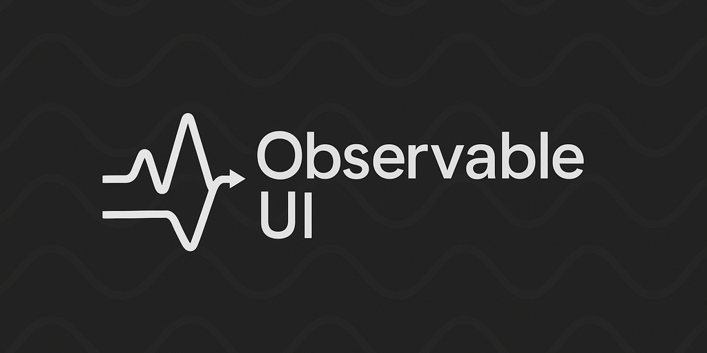

# Observable UI

[](LICENSE)


R3 に uGUI 関連の機能を追加する軽量ライブラリ．




## 🌀 概要

ObservableUI は，R3（Reactive Extensions for Unity）を拡張し，Unity の uGUI と TextMeshPro コンポーネントに対するリアクティブな UI バインディングを提供する Unity パッケージです．

双方向データバインディング，Observable イベント，リアクティブコンポーネントラッパーを提供し，Unity でリアクティブなユーザーインターフェースを構築するための機能を提供します．

## 🌀 機能

#### フォルダ構成

```
├── ObservableUI
     ├── Core
     │   ├── Interfaces
     │   ├── Components
     │   ├── Extensions
     ├── Editor
```

- `Interfaces` - Observable UI のインターフェース定義
- `Components` - Observable UI のコンポーネント実装
- `Extensions` - 拡張メソッド


#### 1. 拡張メソッド

R3 では uGUI に対する拡張メソッド（イベントObservable化やバインディングなど）が提供されています．

本ライブラリではこれらに，以下を追加します．
- 主要コンポーネントへの双方向バインド（`BindToXXX`）
- `TextMeshPro`コンポーネントの対応

**Text** (TMP)：
```cs
stringRP.SubscribeToText(textMeshPro);
intRP.SubscribeToText(textMeshPro, value => t.text = $"{value} pt");
```

**InputField** (TMP)：
```cs
stringRP.BindToInputField(inputField);
intRP.BindToInputField(inputField, defaultValue: 0);
floatRP.BindToInputField(inputField, format: "F2", defaultValue: 0f);
```

**Dropdown** (TMP)：
```cs
intRP.BindToDropdown(dropdown);
enumRP.BindToDropdown(dropdown, 
    toDropdownValue: e => (int)e, 
    fromDropdownValue: i => (MyEnum)i);
```

**Slider**：
```cs
floatRP.SubscribeToSlider(slider);  // 単方向
floatRP.BindToSlider(slider);       // 双方向
```

**Image**：
```cs
floatObservable.SubscribeToImageFillAmount(image);
colorObservable.SubscribeToImageColor(image);
```

> [!note]
> 基本的にR3標準拡張メソッドと同様ですが，`OnValueChangedAsObservable`では引数の`withCurrentValue`で初期値でOnNextを発火するか選択できるようにしています．

> [!note]
> 単方向バインドを`SubscribeToXXX`，双方向バインドを`BindToXXX`と命名しています．

#### 2. Reactive InputField

InputField は文字列形式でユーザー入力を受け付けるため，常にパース処理を意識する必要があります．
`Reactive InputField` は文字列入力を内部で処理し，`ReactiveProperty` として外部に公開するラッパーコンポーネントです．Int や Float などのシンプルな入力用途で，拡張メソッドと合わせて使用すると便利です．


```cs
FloatReactiveInputField reactiveIF;

reactiveIF.ReactiveProperty
    .Subscribe(value => Debug.Log(value))
    .AddTo(this);
```


## 🌀 セットアップ
#### 要件 / 開発環境
- Unity `6000.0.30f1`
- Unity UI `2.0.0`
- Localization `1.5.4`
- [R3][github: R3]

#### インストール

1. Window > Package ManagerからPackage Managerを開く
2. 「+」ボタン > Add package from git URL
3. 以下のURLを入力する
```
https://github.com/nitou-kanazawa/lib-unity-ObservableUI.git?path=ObservableUI/Assets/ObservableUI
```

あるいはPackages/manifest.jsonを開き、dependenciesブロックに以下を追記
```
{
    "dependencies": {
        "jp.nitou.observableui": "https://github.com/nitou-kanazawa/lib-unity-ObservableUI.git?path=ObservableUI/Assets/ObservableUI"
    }
}
```


## 🌀 既知の未完成機能

以下の機能は現在未実装または部分的に実装されています：

- **`Vector2ReactiveInputField.TryParseFromView()`**: `NotImplementedException` をスローします
- **`Vector3ReactiveInputField.TryParseFromView()`**: `NotImplementedException` をスローします
- **`Assets/ObservableUI/Localization/`**: 空のディレクトリ（将来の機能用）
- **`Assets/ObservableUI/Core/Utilities/`**: 空のディレクトリ（将来の機能用）


<!-- Link -->
[github: R3]: https://github.com/Cysharp/R3
